# Design Tokens 

In design, tokens serve as reusable values that embody design choices, shaping the visual and tactile aspects of our product. These values play a crucial role in maintaining coherence within a design system, encompassing attributes such as colors, spacing, and typography. Orium's Accelerator Figma design kit incorporates predefined variables and tokens, streamlining project setup.

---

## Overview

When starting a new project, designers can update foundational tokens to match the customer's brand guidelines. Using the [Tokens Studio Figma plugin](https://docs.tokens.studio/), designers can export a `tokens.json` file to share with developers, who can then efficiently apply these new values to the coded components in our starter kit.

### Naming Conventions

Employing a unified naming convention promotes seamless value exchange between design and development teams. 

- **Core Tokens**: Fundamental system elements, option tokens, or global tokens e.g., `shading-900`
- **Semantic Tokens**: Alias tokens referencing other tokens, offering contextual information e.g., `color-brand-primary` = `$shading-900`
- **Component Tokens**: Alias tokens specific to UI components e.g., `component.button.lg`

We follow Chakra conventions for naming
- Use camel case e.g., `variableName`, `buttonPrimary`
- Use present tense for actions e.g., `onHover`, `onResponseTrigger`
- Components start with capitals
- For Sizing, Spacing, Scales we use a numerical scale
- For Radii, Border, Opacity, Typography, Box Shadow we use 'numeric' tshirt scale e.g., `2xl`

We follow Nathan Curtis' recommended taxonomy for tokens if we introduce multi-brand
- [Naming Tokens in Design Systems](https://medium.com/eightshapes-llc/naming-tokens-in-design-systems-9e86c7444676) 
- [The Design System Guide](https://thedesignsystem.guide/design-tokens)

---

## 1. Designer Setup - Figma Tokens Studio Plugin
For more information, please refere to [Token Studio's documentation](https://tokens.studio/).

### 1. Run the Tokens Studio Plugin
* Open your Figma file
* Run the Figma Tokens plugin

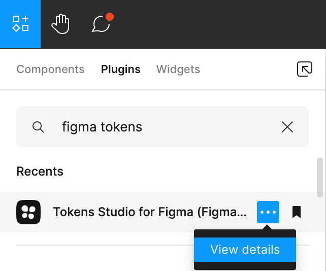

### 2. Updating Default Tokens
**Note:** With Token Studio we can't remove tokens even if they aren't in use. Leave unused tokens in place or it will break the build

When working with the Orium Accelerator, designer’s have access to pre-defined tokens that align with developer naming conventions. When a new project is started, foundational tokens are updated to match client documentation.

**2.1 Edit existing token values within the Tokens Studio window.**

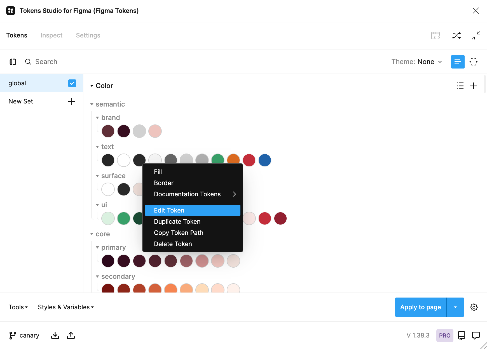

**2.2 Once complete, `Sync Variables` to update the native Figma Variables window**

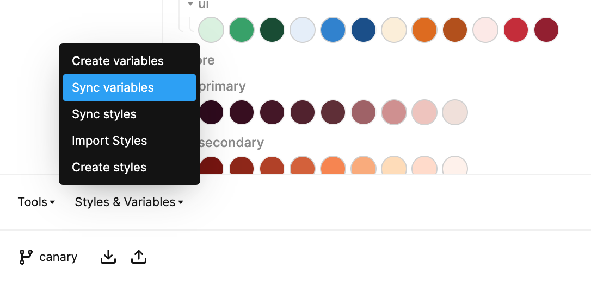

### 3. Connecting to Github

**Note:** If you do not have access to Github, request using the [Github Change Request](https://sites.google.com/a/myplanet.com/launchpad/it/information-technology-it/change-requests/github-request) form. Otherwise, work with your Developer to create and input a personal access token into the Tokens Studio panel (or designer with Github Access)

1. Open the Settings tab in the Figma Tokens plugin.
2. In the Sync Providers section, select Add New > Github.
3. Name your configuration (e.g., figma-tokens-github).
4. Create a new [Personal Access Token](https://docs.github.com/en/enterprise-server@3.6/authentication/keeping-your-account-and-data-secure/managing-your-personal-access-tokens) and add its value to the relevant field in the Figma Tokens config window. 
   1. Log into your Github account
   2. Go to *Account > Settings*
   3. *Settings > Developer Settings* (Left Sidebar)
   4. *Personal Access Tokens > Tokens (classic) > Generate new token*
   5. Set Name, Expiration (never), select *Repo > Generate Token*
   6. Paste into Tokens Studio Input Field
5. Copy the ‘Owner/Repo-Name’ eg. ‘oriuminc/composable-pro’ and add this value to the Figma Tokens config window (remove spaces)

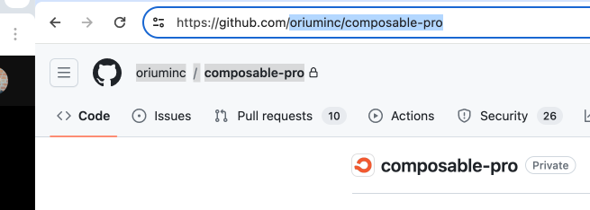

6. Return to Figma to complete the setup. 

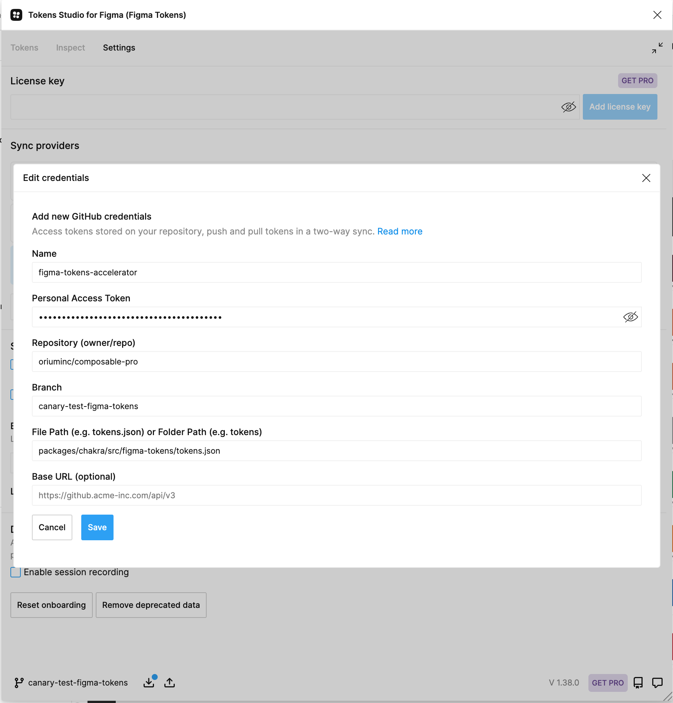

### 4. Pushing Your Tokens to GitHub from Figma

**Note:** We have set up [foundations pages in Storybook](https://oriumhq.jira.com/wiki/spaces/CWA/pages/459997256/OA+Design+System+Starter+Automation+and+Continuous+Integration+with+Design+Tokens#Storybook-Foundations-Pages) to dynamically display design tokens. These pages are updated automatically and require no ongoing maintenance.

#### First Time Push

If a JSON file exists in the connected repository, the plugin will prompt you to import those values into your Figma file. In case your project doesn't have an existing JSON file on GitHub, you can push your values from Figma to the repository.

#### Pushing Tokens to Github

The tokens.json file acts as a shared source of truth between Figma and the coded components. When changes are made and pushed, both environments will reflect the same tokens.

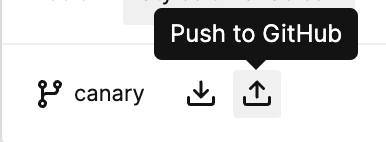

1. Click the PUSH icon at the bottom of the window.
2. Add a [Commit Message](https://www.atlassian.com/git/tutorials/saving-changes/git-commit) (e.g., 'Pushing tokens').
3. Select the branch you want to update and click Push. 
4. If pushing to a [Branch](https://docs.github.com/en/pull-requests/collaborating-with-pull-requests/proposing-changes-to-your-work-with-pull-requests/about-branches) other than main, create a [Pull Request](https://docs.github.com/en/pull-requests/collaborating-with-pull-requests/proposing-changes-to-your-work-with-pull-requests/about-pull-requests). 

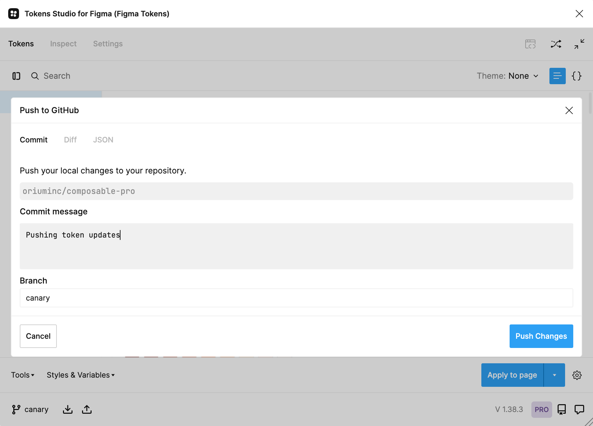

#### Pulling Tokens from Github

To pull updates from dev, press the pull button to accept changes

---

## 2. Developer Set Up

### 2.1 What is `transformedTokens.json`?

- **Tokens.json**: Figma will automatically generate a `tokens.json` file and push it to your specified repository path. By default, this path is set to `packages/chakra/src/figma-tokens/tokens.json`.

- **TransformedTokens.json:** The `transformedTokens.json` file is derived from the `tokens.json` file. This JSON file serves as a mapping mechanism for the Chakra UI theme system. It can either be version-controlled directly in your repository or fetched from a CMS system.

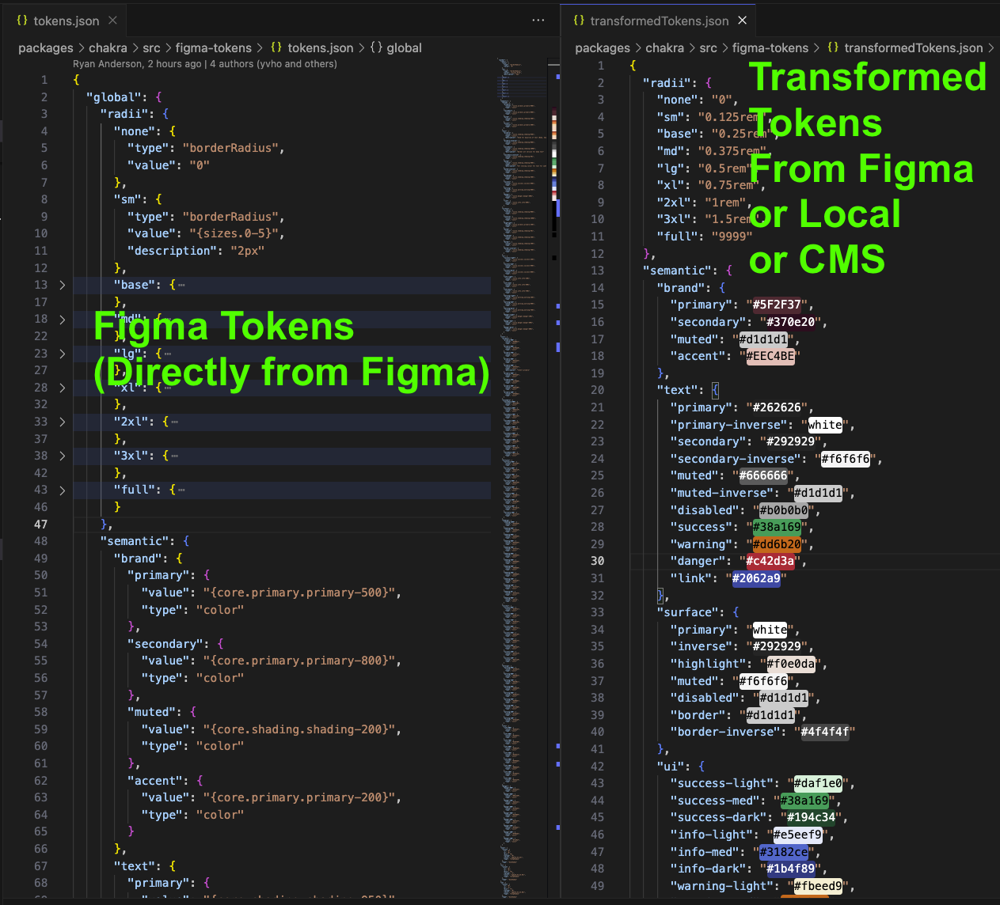

### 2.2 Generating `transformedTokens.json`

The `transformedTokens.json` file is not version-controlled in Git. To generate this file, you can trigger it in multiple ways:

- Running `pnpm dev` will automatically execute a predev script that generates the file.
- The prebuild or postinstall scripts should also invoke the transformFigmaTokens script to produce the file.

If you encounter any issues, ensure that the script is being called correctly. Once set up properly, the system will automatically update transformedTokens.json, eliminating the need for manual intervention.

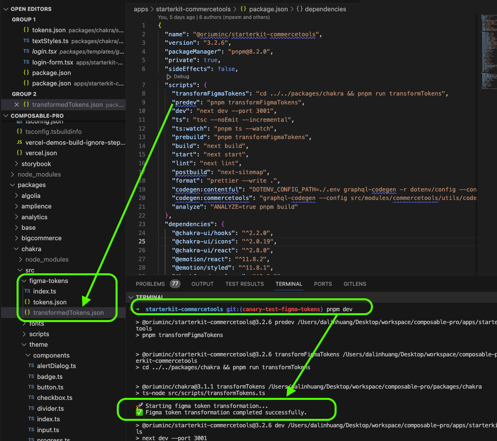

### 2.3 Utilizing `transformedTokens.json` in the Chakra UI Styling System

- **Direct Mapping:** Tokens are dynamically mapped (see Screenshot 1). New tokens are automatically integrated.
- **Indirect Mapping:** Tokens are hard-coded, requiring a developer to manually update for any new additions. (see Screenshot 2).

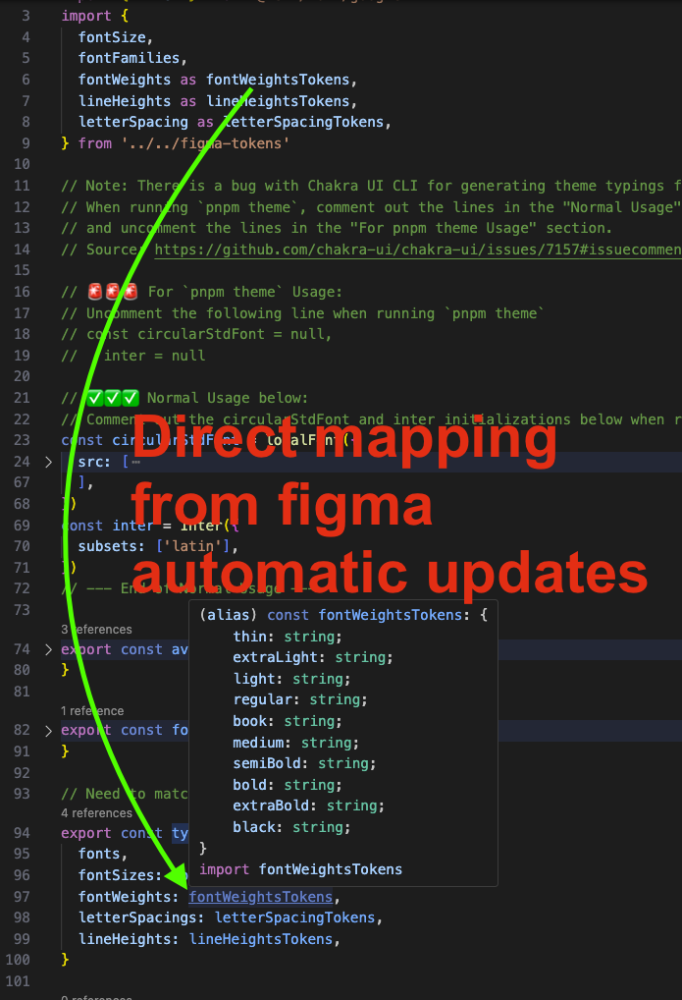

*Direct Mapping*

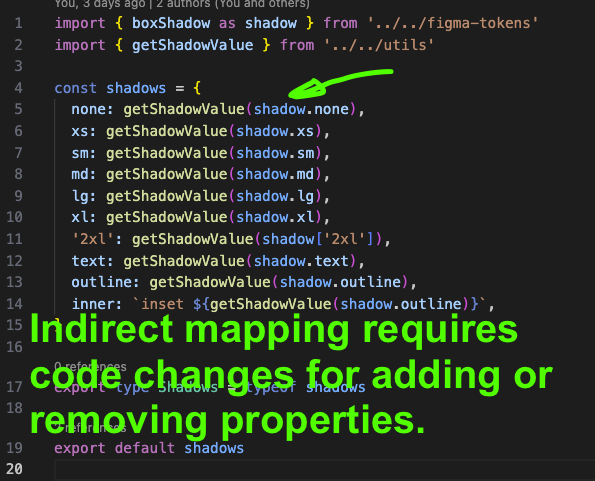

*Indrect Mapping*

---

### 2.4 Fonts

Fonts require a **one-time manual setup** by a developer, as the fontFamily names are dynamic (see screenshot below). For Figma-controlled dynamic fonts, create a mapping method to link Figma's `fontFamilies` with the imported fonts. This allows you to switch primary and secondary fonts from Figma. Note that introducing new fonts will still require developer intervention.

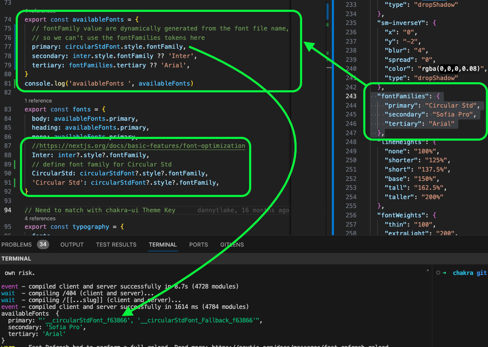

---

### 2.5 Theme typings and Autocomplete (control + space)

<blockquote> IMPORTANT: Chakra UI CLI has a bug affecting theme typings and autocomplete. Read below for the workaround. </blockquote>

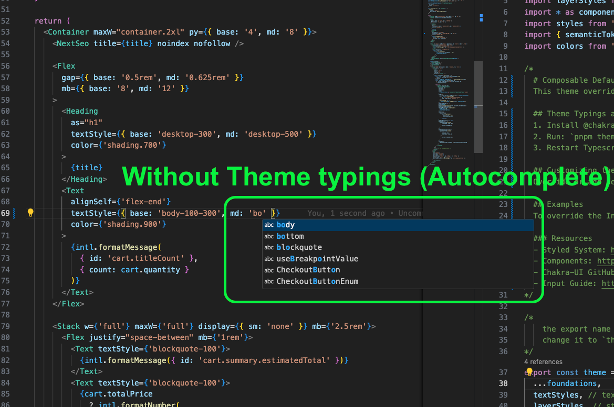

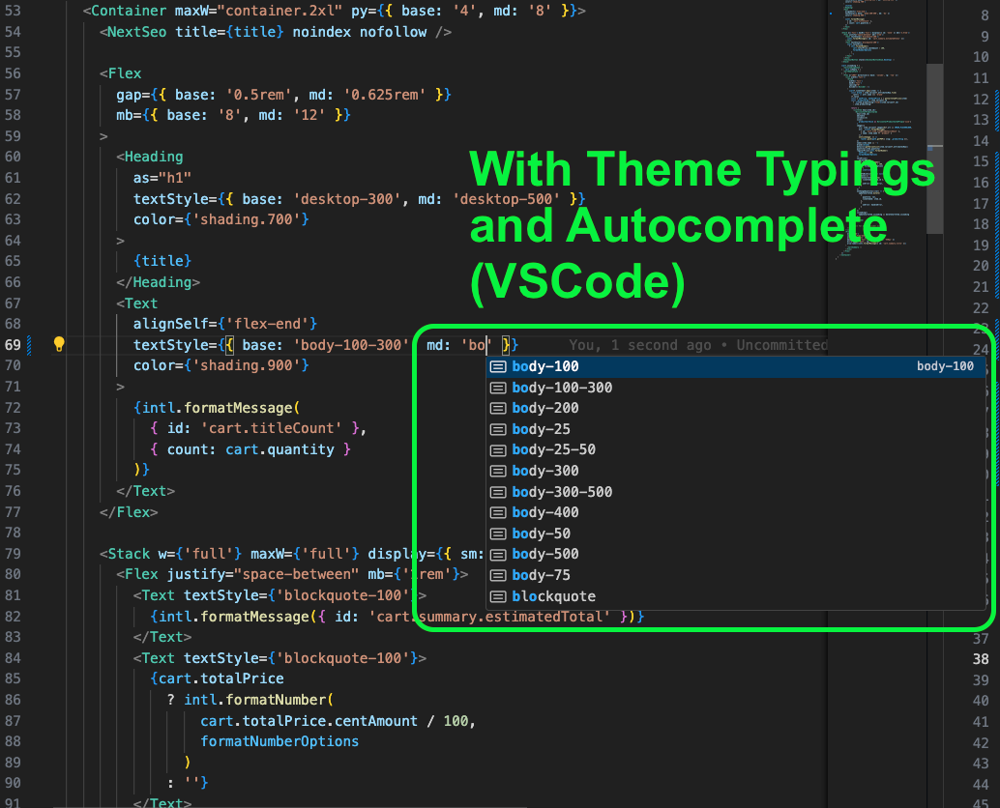

#### 2.5.1 How to enable Theme typings and Autocomplete?

To run `pnpm theme`, you'll need to make code adjustments.

1. Comment out the 'Normal Usage' section below.
2. Uncomment the 'For pnpm theme Usage' section.
3. Run `pnpm theme` in the `packages/chakra` folder
4. Restart Typescript Server: (Command + Shift + P) -> "Restart TS server" 

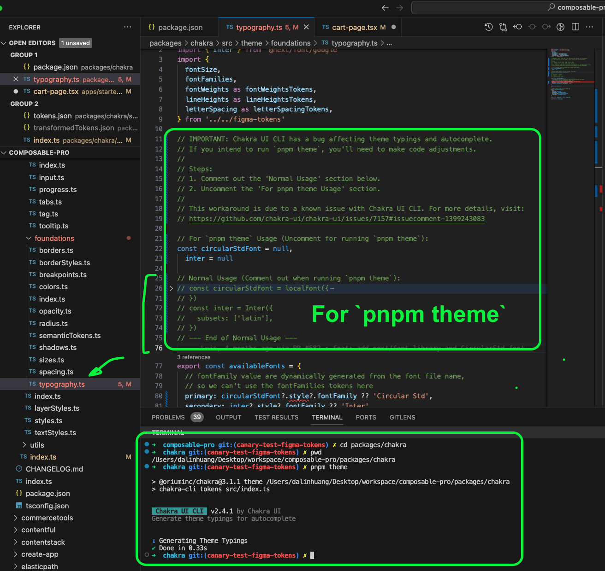

5. Check in code (control + space) and see if you have correct autocomplete for theme tokens (for ex: `body-100`)
6. Uncomment the code for `Normal Usage`, you only need to do this once for your VSCode, unless there is changes to the figma token names

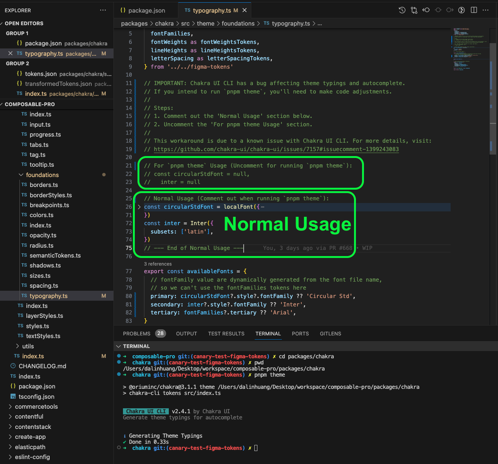

### 2.6 Customized components

Whenever possible, use tokens instead of hardcoded values. This practice enhances maintainability and ensures consistent styling across your application.

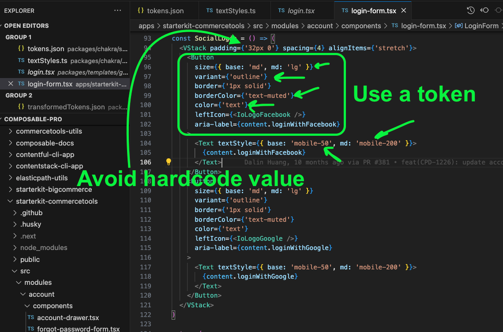

<blockquote>This readme onboarding guide focuses on the core concepts of Figma's design system and related components. If you have any specific questions or need further assistance, please don't hesitate to ask.</blockquote>

---
## Appendix

### Optional Storybook Foundations Pages

If included in our SOW, Storybook can be used as a component library. We have set up foundations pages in Storybook to dynamically display design tokens. These pages are updated automatically and require no ongoing maintenance.

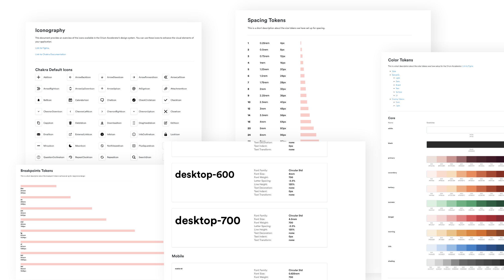
